# oh-my-pi Architecture

A comprehensive architecture document covering the design of oh-my-pi at multiple abstraction levels, with communication flow diagrams and references to key implementation files.

## Table of Contents

1. [System Context (Level 0)](#1-system-context-level-0)
2. [Package Architecture (Level 1)](#2-package-architecture-level-1)
3. [Coding-Agent Layered Architecture (Level 2)](#3-coding-agent-layered-architecture-level-2)
4. [Communication Flows (Level 3)](#4-communication-flows-level-3)
   - [Application Startup](#41-application-startup-flow)
   - [Prompt-Response Cycle](#42-prompt-response-cycle)
   - [Tool Execution Pipeline](#43-tool-execution-pipeline)
   - [Streaming Response Pipeline](#44-streaming-response-pipeline)
   - [Hook and Extension Interception](#45-hook-and-extension-interception)
   - [Session Persistence](#46-session-persistence)
   - [Context Compaction](#47-context-compaction)
   - [Subagent Task Execution](#48-subagent-task-execution)
   - [MCP Server Communication](#49-mcp-server-communication)
   - [TUI Differential Rendering](#410-tui-differential-rendering)
5. [Component Deep Dives (Level 4)](#5-component-deep-dives-level-4)
   - [AgentSession](#51-agentsession)
   - [Agent Loop](#52-agent-loop)
   - [LLM Provider Abstraction](#53-llm-provider-abstraction)
   - [Capability Discovery System](#54-capability-discovery-system)
   - [Session Tree Structure](#55-session-tree-structure)
   - [OutputSink and Streaming Output](#56-outputsink-and-streaming-output)
6. [Cross-Cutting Concerns](#6-cross-cutting-concerns)

---

## 1. System Context (Level 0)

At the highest level, oh-my-pi is a terminal-based AI coding agent that sits between the user and multiple external systems.

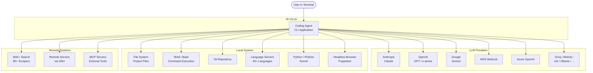

**Key interactions:**
- **User** communicates via terminal (interactive TUI, print mode, or RPC protocol)
- **LLM Providers** receive prompts and return streaming responses with tool calls
- **Local System** tools (file I/O, shell, git, LSP, Python) are invoked by the LLM through tool definitions
- **Remote Systems** (web, SSH, MCP) extend the agent's reach beyond the local machine

---

## 2. Package Architecture (Level 1)

The monorepo contains 6 TypeScript packages and 3 Rust crates with a strict dependency hierarchy.

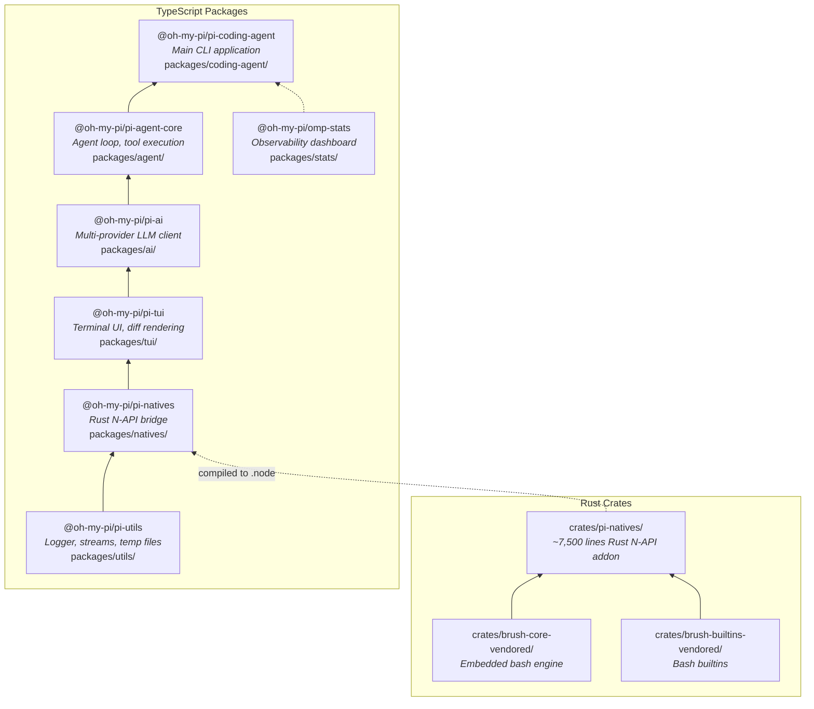

### Package Responsibilities

| Package | Size | Key Exports | Purpose |
|---------|------|-------------|---------|
| `pi-utils` | Foundation | `logger`, `isEnoent()`, `Snowflake`, streams | Shared utilities with zero circular deps |
| `pi-natives` | Bridge | `grep()`, `glob()`, `visibleWidth()`, `highlightCode()`, `Shell`, `PtySession` | TypeScript wrappers around 13 Rust N-API modules |
| `pi-tui` | UI | `TUI`, `Editor`, `Container`, `Markdown`, `SelectList` | Differential rendering engine and UI components |
| `pi-ai` | LLM | `stream()`, `streamSimple()`, `getModel()`, provider implementations | Multi-provider streaming client (15+ providers) |
| `pi-agent-core` | Runtime | `Agent`, `agentLoop()`, tool execution, event system | Core agent loop: prompt → model → tools → response |
| `pi-coding-agent` | App | `AgentSession`, modes, tools, extensions, discovery | **Primary focus** - the full CLI application |

### Rust Native Modules

The Rust crate (`crates/pi-natives/`) compiles to a platform-specific `.node` addon:

| Module | Lines | Key Functions | Powered By |
|--------|-------|---------------|------------|
| `grep` | ~1,300 | `grep()`, `searchContent()`, `fuzzyFind()` | ripgrep internals |
| `shell` | ~1,025 | `executeShell()`, `Shell` sessions | brush-shell (vendored) |
| `text` | ~1,280 | `visibleWidth()`, `truncateToWidth()`, `wrapTextWithAnsi()` | unicode-width |
| `keys` | ~1,300 | `parseKey()`, `parseKittySequence()` | PHF perfect-hash |
| `highlight` | ~475 | `highlightCode()`, language detection | syntect |
| `glob` | ~340 | `glob()`, gitignore-aware discovery | ignore + globset |
| `task` | ~350 | Blocking work scheduler on libuv pool | tokio + napi |
| `ps` | ~290 | `killTree()`, `listDescendants()` | libc / libproc |
| `prof` | ~250 | Circular buffer profiler, flamegraph | inferno |
| `system_info` | ~170 | `getSystemInfo()` | sysinfo |
| `image` | ~150 | Decode/encode/resize images | image crate |
| `clipboard` | ~95 | `copyToClipboard()`, `readImageFromClipboard()` | arboard |
| `html` | ~50 | `htmlToMarkdown()` | html-to-markdown-rs |

---

## 3. Coding-Agent Layered Architecture (Level 2)

The coding-agent (`packages/coding-agent/src/`) has a layered architecture where each layer depends only on the layers below it.

```mermaid
graph TB
    subgraph "CLI Layer"
        CLI["cli.ts<br/><i>Command routing</i>"]
        Args["cli/args.ts<br/><i>Argument parsing</i>"]
        Commands["commands/<br/><i>launch, commit, config,<br/>grep, plugin, setup, ...</i>"]
    end

    subgraph "Mode Layer"
        Interactive["modes/interactive-mode.ts<br/><i>TUI with differential rendering</i>"]
        Print["modes/print-mode.ts<br/><i>Non-interactive stdout</i>"]
        RPC["modes/rpc/rpc-mode.ts<br/><i>JSON stdin/stdout protocol</i>"]
        Components["modes/components/<br/><i>Footer, editor, selectors,<br/>messages, tool display</i>"]
        Controllers["modes/controllers/<br/><i>Command, event, input,<br/>selector, extension UI</i>"]
    end

    subgraph "Core Layer"
        Session["session/agent-session.ts<br/><i>THE central abstraction</i>"]
        SDK["sdk.ts<br/><i>Session factory + discovery</i>"]
        SysProm["system-prompt.ts<br/><i>System prompt builder</i>"]
        Main["main.ts<br/><i>Startup orchestrator</i>"]
        SessionMgr["session/session-manager.ts<br/><i>JSONL persistence</i>"]
        Settings["config/settings-manager.ts<br/><i>User preferences</i>"]
    end

    subgraph "Tool Layer"
        Tools["tools/<br/><i>read, write, edit, bash,<br/>grep, find, python, ssh,<br/>browser, task, todo, ...</i>"]
        ToolResult["tools/tool-result.ts<br/><i>ToolResultBuilder</i>"]
        OutputUtils["tools/output-utils.ts<br/><i>TailBuffer, artifacts</i>"]
    end

    subgraph "Extension Layer"
        Hooks["extensibility/hooks/<br/><i>Event interception</i>"]
        Extensions["extensibility/extensions/<br/><i>Lifecycle plugins</i>"]
        CustomTools["extensibility/custom-tools/<br/><i>User-defined tools</i>"]
        Skills["extensibility/skills.ts<br/><i>On-demand capabilities</i>"]
        Plugins["extensibility/plugins/<br/><i>npm-based plugins</i>"]
    end

    subgraph "Discovery Layer"
        Capability["capability/<br/><i>Unified type registry</i>"]
        Discovery["discovery/<br/><i>Claude, Cursor, Windsurf,<br/>Gemini, Codex, Cline,<br/>Copilot, VS Code</i>"]
    end

    subgraph "Integration Layer"
        WebScrape["web/scrapers/<br/><i>80+ site-specific scrapers</i>"]
        WebSearch["web/search/<br/><i>Anthropic, Perplexity, Exa</i>"]
        LSPClient["lsp/<br/><i>40+ language servers</i>"]
        IPython["ipy/<br/><i>Python/IPython kernel</i>"]
        MCPMgr["mcp/<br/><i>MCP server management</i>"]
        TaskExec["task/<br/><i>Subagent spawning</i>"]
        SSHExec["ssh/<br/><i>Remote execution</i>"]
    end

    CLI --> Main
    Args --> Main
    Commands --> Main
    Main --> SDK
    SDK --> Session
    SDK --> SysProm

    Interactive --> Session
    Print --> Session
    RPC --> Session
    Components --> Interactive
    Controllers --> Interactive

    Session --> Tools
    Session --> SessionMgr
    Session --> Settings

    Tools --> ToolResult
    Tools --> OutputUtils

    Session --> Hooks
    Session --> Extensions
    Session --> CustomTools
    Session --> Skills

    Extensions --> Capability
    Hooks --> Capability
    Capability --> Discovery

    Tools --> WebScrape
    Tools --> WebSearch
    Tools --> LSPClient
    Tools --> IPython
    Tools --> MCPMgr
    Tools --> TaskExec
    Tools --> SSHExec
```

### Key Source Directories

| Directory | Files | Purpose |
|-----------|-------|---------|
| `tools/` | 25+ | Built-in tool implementations (each is a factory function) |
| `prompts/` | 30+ | All prompt templates as static `.md` files (Handlebars) |
| `session/` | 10+ | Session persistence (JSONL), auth storage (SQLite), compaction |
| `modes/` | 30+ | Run modes and TUI components/controllers/themes |
| `extensibility/` | 20+ | Hooks, extensions, custom tools, skills, slash commands, plugins |
| `capability/` | 12 | Capability type definitions (one per capability type) |
| `discovery/` | 12 | Config discovery from 8 AI coding tools |
| `web/` | 80+ | Site-specific scrapers and search providers |
| `lsp/` | 10+ | Language Server Protocol client and configs |
| `ipy/` | 6 | Python/IPython kernel integration |
| `mcp/` | 8 | Model Context Protocol server management |
| `task/` | 8 | Subagent spawning and parallel execution |

---

## 4. Communication Flows (Level 3)

### 4.1 Application Startup Flow

The startup sequence from `omp` command to ready-for-input state.

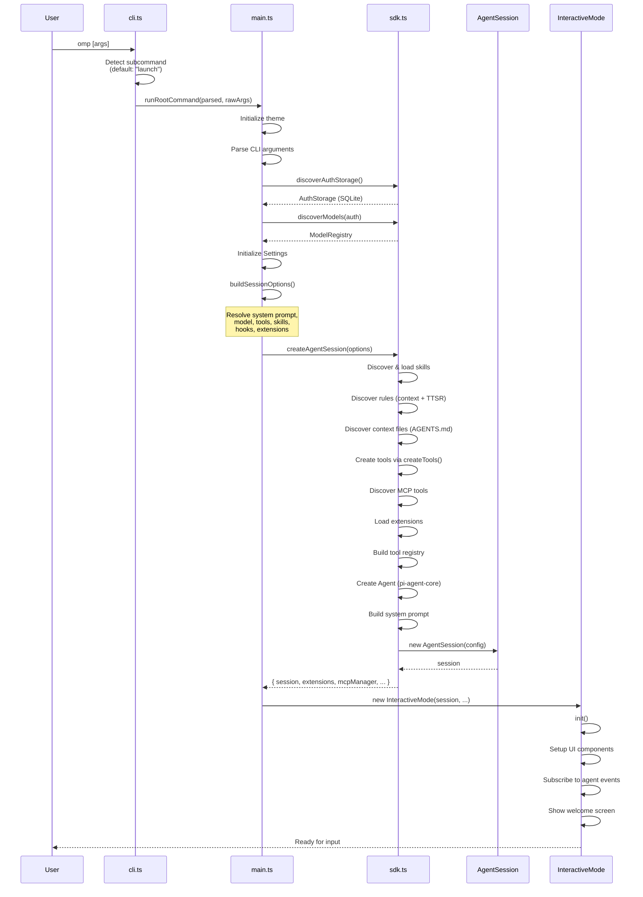

**Key files:**
- `packages/coding-agent/src/cli.ts` — CLI entry, command routing
- `packages/coding-agent/src/main.ts` — `runRootCommand()`, startup orchestration
- `packages/coding-agent/src/sdk.ts` — `createAgentSession()`, discovery functions
- `packages/coding-agent/src/session/agent-session.ts` — `AgentSession` constructor

---

### 4.2 Prompt-Response Cycle

The core interaction loop: user types a prompt, the LLM responds with text and tool calls, tools execute, results feed back to the LLM.

```mermaid
sequenceDiagram
    participant User
    participant Mode as InteractiveMode
    participant Session as AgentSession
    participant Agent as Agent<br/>(pi-agent-core)
    participant Loop as agentLoop()
    participant LLM as LLM Provider
    participant Tools as Tool Registry

    User->>Mode: Type prompt + Enter
    Mode->>Session: prompt(text, options)
    Session->>Session: Check for slash commands
    Session->>Session: Check for prompt templates
    Session->>Agent: prompt(userMessage)
    Agent->>Loop: agentLoop(prompts, context, config)

    loop Agent Turn Loop
        Loop->>Loop: transformContext(messages)
        Loop->>Loop: convertToLlm(messages)
        Loop->>LLM: streamSimple(model, context, options)
        LLM-->>Loop: AssistantMessageEventStream

        Loop->>Loop: Buffer streaming events
        Loop-->>Session: emit(message_start)
        Session-->>Mode: event → render message

        loop Streaming Chunks
            LLM-->>Loop: text_delta / toolcall_delta
            Loop-->>Session: emit(message_update)
            Session-->>Mode: event → update UI
        end

        LLM-->>Loop: done (with tool_calls?)

        alt Has Tool Calls
            Loop-->>Session: emit(tool_execution_start)
            Loop->>Tools: execute(toolCallId, params, signal)
            Tools-->>Loop: AgentToolResult
            Loop-->>Session: emit(tool_execution_end)
            Loop->>Loop: Append tool results to context
            Note over Loop: Continue loop<br/>(send results back to LLM)
        else No Tool Calls
            Loop-->>Session: emit(message_end)
            Note over Loop: Exit loop
        end
    end

    Session-->>Mode: emit(agent_end)
    Mode-->>User: Show final response
```

**Key files:**
- `packages/agent/src/agent.ts` — `Agent.prompt()`, message queuing
- `packages/agent/src/agent-loop.ts` — `agentLoop()`, turn management
- `packages/ai/src/stream.ts` — `stream()` dispatcher, `streamSimple()` wrapper

---

### 4.3 Tool Execution Pipeline

Detailed view of how a single tool call flows through the system, including hook/extension interception.

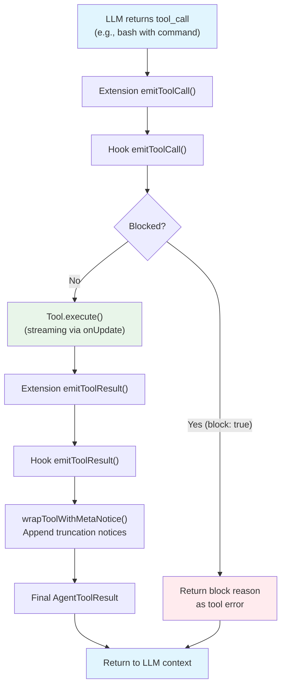

**Extension interception points** (from `extensibility/extensions/runner.ts`):

```typescript
// Before tool execution - can block
emitToolCall(event: ToolCallEvent): Promise<{ block?: boolean; reason?: string }>

// After tool execution - can modify result
emitToolResult(event: ToolResultEvent): Promise<ModifiedToolResult>
```

**Key files:**
- `packages/coding-agent/src/extensibility/hooks/runner.ts` — `HookRunner.emitToolCall()`
- `packages/coding-agent/src/extensibility/extensions/runner.ts` — `ExtensionRunner.emitToolCall()`
- `packages/coding-agent/src/tools/output-meta.ts` — `wrapToolWithMetaNotice()`

---

### 4.4 Streaming Response Pipeline

How streaming data flows from the LLM provider through the system to the terminal.

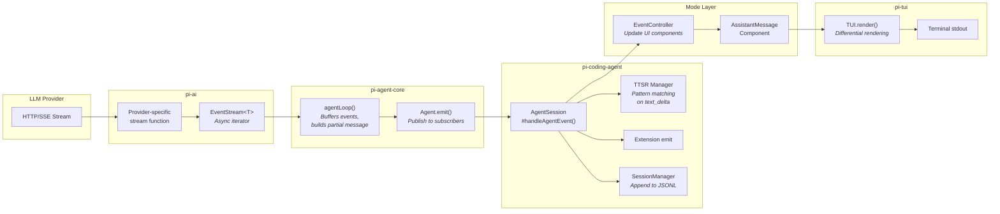

**Event types flowing through the pipeline:**

| Event | Source | Contains |
|-------|--------|----------|
| `message_start` | Agent | Partial `AssistantMessage` |
| `message_update` | Agent | Updated partial with new content |
| `text_delta` | Provider | Incremental text chunk |
| `thinking_delta` | Provider | Incremental reasoning chunk |
| `toolcall_start` | Provider | Tool call ID and name |
| `toolcall_delta` | Provider | Incremental tool arguments |
| `toolcall_end` | Provider | Complete tool call |
| `message_end` | Agent | Final complete message |
| `agent_end` | Agent | Completion reason, error state |

**Key files:**
- `packages/ai/src/utils/event-stream.ts` — `EventStream<T, R>` async iterator
- `packages/agent/src/agent-loop.ts` — Event buffering and emission
- `packages/coding-agent/src/session/agent-session.ts` — `#handleAgentEvent()`

---

### 4.5 Hook and Extension Interception

The complete event lifecycle showing every interception point available to hooks and extensions.

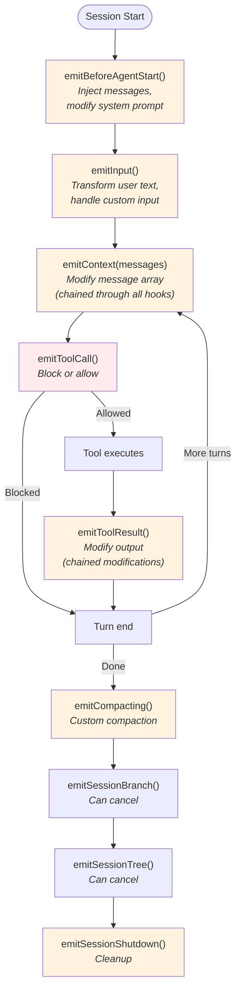

**Extension API methods** (from `extensibility/extensions/types.ts`):

| Method | When Called | Can... |
|--------|-----------|--------|
| `emitBeforeAgentStart()` | Before first LLM call | Inject messages, replace system prompt |
| `emitInput()` | On user text submission | Transform text, mark as "handled" |
| `emitContext()` | Before each LLM call | Modify message array (structured clone) |
| `emitToolCall()` | Before tool execution | Block with reason |
| `emitToolResult()` | After tool execution | Modify content, details, isError flag |
| `emit("session_before_compact")` | Before compaction | Cancel operation |
| `emit("session_before_branch")` | Before branching | Cancel operation |
| `emit("session_shutdown")` | Before exit | Perform cleanup |

---

### 4.6 Session Persistence

How conversations are stored as append-only JSONL trees.

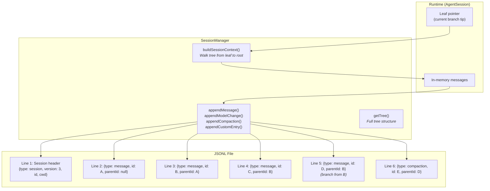

**Tree structure example:**

```
     A (root message)
     |
     B (user prompt)
    / \
   C   D  ← Branch point: two different responses
   |   |
   ...  E (compaction of D's branch)
        |
        F (new messages after compaction)
```

**File location:** `~/.omp/agent/sessions/<cwd-path>/<timestamp>_<sessionId>.jsonl`

**Key files:**
- `packages/coding-agent/src/session/session-manager.ts` — JSONL read/write, tree navigation
- `packages/coding-agent/src/session/agent-session.ts` — `branch()`, `navigateTree()`

---

### 4.7 Context Compaction

When the conversation approaches the context window limit, compaction summarizes older messages.

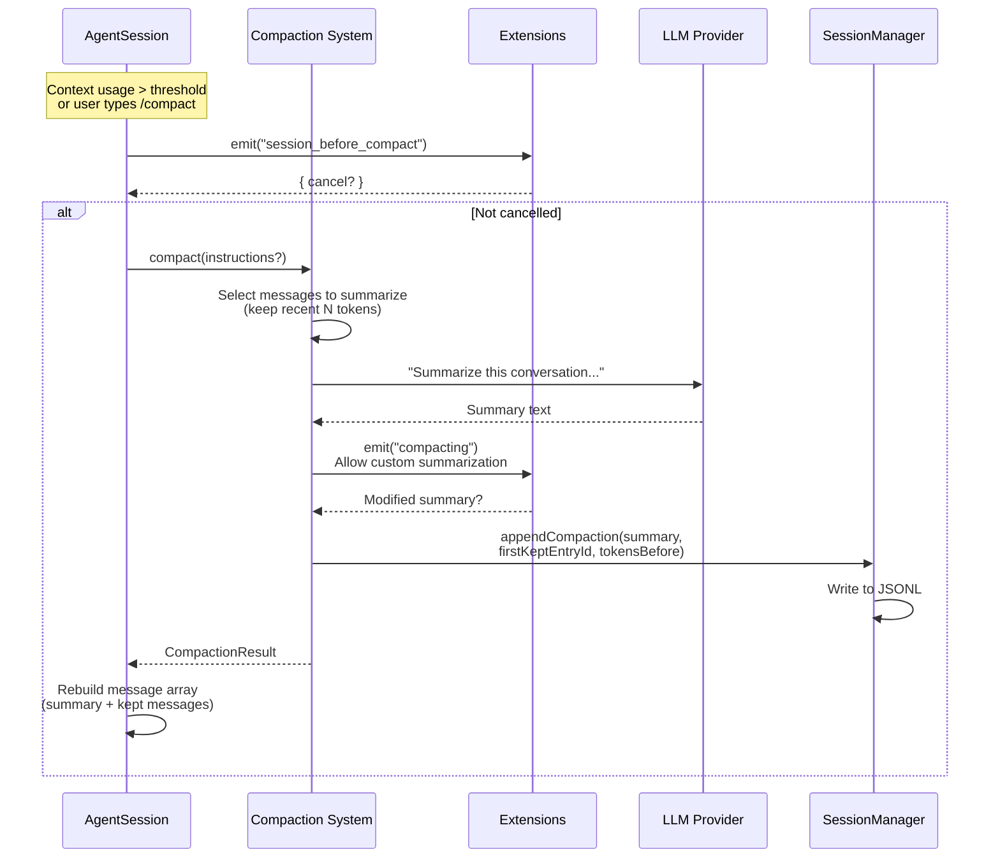

**Compaction preserves:**
- System prompt (always)
- Recent messages (configurable via `compaction.keepRecentTokens`)
- Custom data from hooks (`preserveData`)
- Extension state

**Key files:**
- `packages/coding-agent/src/session/compaction/index.ts` — Compaction logic
- `packages/coding-agent/src/session/agent-session.ts` — `compact()`, auto-compaction trigger

---

### 4.8 Subagent Task Execution

How the Task tool spawns independent sub-agents for parallel work.

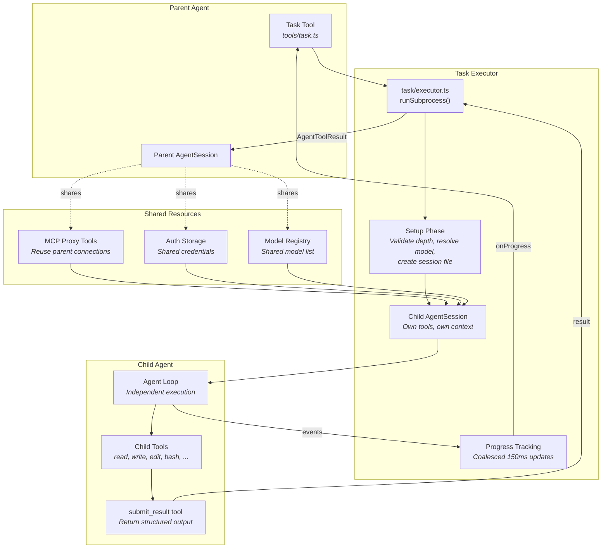

**Task depth control:** Subagents track their nesting level via `taskDepth`. At max depth, the Task tool is removed to prevent infinite recursion.

**Built-in agent types:** `explore`, `plan`, `browser`, `task`, `reviewer` — each with tailored system prompts and tool sets.

**Key files:**
- `packages/coding-agent/src/task/executor.ts` — `runSubprocess()`, progress tracking
- `packages/coding-agent/src/task/agents.ts` — Agent type definitions

---

### 4.9 MCP Server Communication

How MCP (Model Context Protocol) servers are discovered, connected, and used.

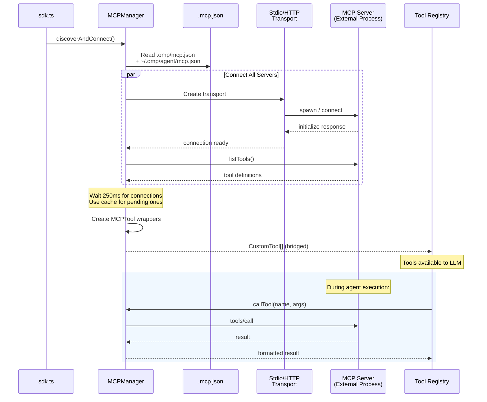

**Key features:**
- **Parallel connection** — All servers connect simultaneously
- **Startup timeout** — 250ms grace period, then use cached tool definitions
- **Auth resolution** — OAuth credentials and shell variable substitution
- **Connection reuse** — Subagents proxy through parent's MCP connections

**Key files:**
- `packages/coding-agent/src/mcp/manager.ts` — `MCPManager`, connection lifecycle
- `packages/coding-agent/src/mcp/tool-bridge.ts` — MCPTool / DeferredMCPTool wrappers

---

### 4.10 TUI Differential Rendering

How the terminal UI efficiently updates the screen.

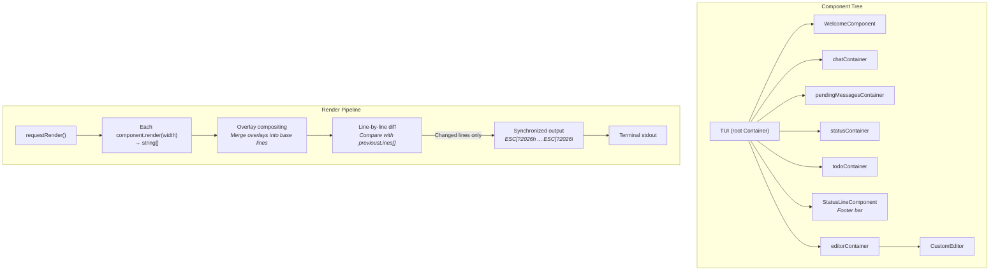

**Rendering modes:**

| Mode | When | Cost |
|------|------|------|
| **Full re-render** | First render, terminal resize, content above viewport | All lines |
| **Partial update** | Normal updates (most common) | Only changed lines |
| **Cleanup** | Content shrunk | Clear extra lines |

**ANSI-aware operations** (all via Rust N-API for performance):
- `visibleWidth()` — Width ignoring escape codes and hyperlinks
- `truncateToWidth()` — Truncate with ellipsis, respecting wide chars
- `sliceWithWidth()` — Column-based extraction for overlay compositing
- `wrapTextWithAnsi()` — Line wrapping that preserves SGR codes across breaks

**Key files:**
- `packages/tui/src/tui.ts` — `TUI` class, `#doRender()` differential algorithm
- `packages/tui/src/components/` — All UI components

---

## 5. Component Deep Dives (Level 4)

### 5.1 AgentSession

`AgentSession` (`session/agent-session.ts`) is the central abstraction that all three modes share.

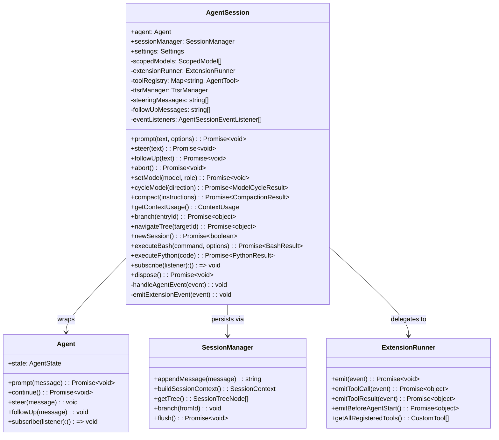

**Internal event handling** in `#handleAgentEvent()`:

```
1. Emit to extensions (emitExtensionEvent)
2. Emit to all subscribed listeners
3. Persist messages (appendMessage on message_end)
4. Handle auto-retry (on retryable errors)
5. Handle auto-compaction (when context exceeds threshold)
6. Handle TTSR pattern matching:
   - Monitor text_delta and toolcall_delta
   - Check patterns against TtsrManager
   - If match: abort stream, inject rules, retry
7. Handle todo completion reminders
8. Handle streaming edit abort detection
```

---

### 5.2 Agent Loop

The agent loop in `packages/agent/src/agent-loop.ts` implements the core prompt-tool-response cycle.

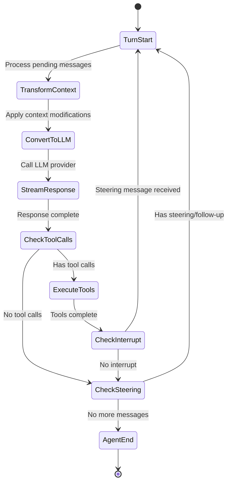

**Tool concurrency modes:**
- `"shared"` (default) — Tools in a batch execute in parallel
- `"exclusive"` — Tool executes alone, blocking others in the batch

**Message queue processing:**

```typescript
// Steering: interrupts current turn
agent.steer("new instruction")  // Queued, delivered after current tool batch

// Follow-up: continues after agent would stop
agent.followUp("also do this")  // Queued, delivered when agent has no more work
```

---

### 5.3 LLM Provider Abstraction

The `pi-ai` package provides a unified streaming interface across 15+ providers.

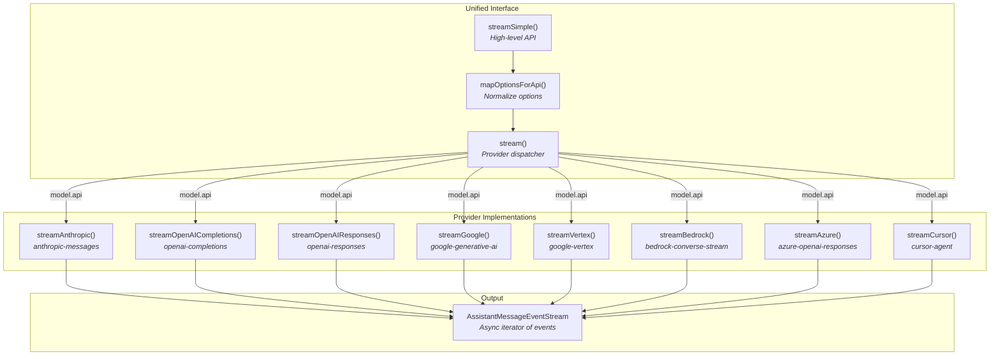

**Thinking/reasoning mapping per provider:**

| Provider | Thinking Mode | Mechanism |
|----------|---------------|-----------|
| Anthropic | `thinkingEnabled` + budget or `effort` | Budget-based (older) or effort level (Opus 4.6+) |
| OpenAI | `reasoningEffort` | `"minimal"` / `"low"` / `"medium"` / `"high"` |
| Google | `thinking.enabled` + `budgetTokens` or `level` | Budget (older) or level (Gemini 3+) |
| Bedrock | Same as Anthropic | Claude models on AWS |

**Key files:**
- `packages/ai/src/stream.ts` — `stream()`, `streamSimple()`, `mapOptionsForApi()`
- `packages/ai/src/providers/anthropic.ts` — Anthropic streaming implementation
- `packages/ai/src/providers/openai-completions.ts` — OpenAI implementation
- `packages/ai/src/providers/google.ts` — Google Gemini implementation

---

### 5.4 Capability Discovery System

The capability system provides unified configuration loading from 8 AI coding tools.

```mermaid
flowchart TB
    subgraph "Capability Registry (capability/)"
        Define["defineCapability&lt;T&gt;()"]
        Register["registerProvider&lt;T&gt;()"]
        Load["loadCapability&lt;T&gt;()"]
    end

    subgraph "Capability Types"
        CtxFile["context-file"]
        Ext["extension"]
        Hook["hook"]
        Instr["instruction"]
        MCPCap["mcp"]
        Rule["rule"]
        Skill["skill"]
        SlashCmd["slash-command"]
        SysProm["system-prompt"]
        ToolCap["tool"]
    end

    subgraph "Discovery Providers (discovery/)"
        Builtin["builtin<br/><i>Built-in defaults</i>"]
        Claude["claude<br/><i>.claude/ directories</i>"]
        CursorD["cursor<br/><i>.cursor/, .cursorrules</i>"]
        Windsurf["windsurf<br/><i>.windsurfrules</i>"]
        GeminiD["gemini<br/><i>.gemini/ directories</i>"]
        CodexD["codex<br/><i>.codex/, AGENTS.md</i>"]
        ClineD["cline<br/><i>.clinerules, .mcp.json</i>"]
        VSCode["vscode<br/><i>.vscode/ settings</i>"]
        GitHub["github<br/><i>copilot-instructions.md</i>"]
    end

    Define --> CtxFile
    Define --> Ext
    Define --> Hook
    Define --> Instr
    Define --> MCPCap
    Define --> Rule
    Define --> Skill
    Define --> SlashCmd
    Define --> SysProm
    Define --> ToolCap

    Register --> Builtin
    Register --> Claude
    Register --> CursorD
    Register --> Windsurf
    Register --> GeminiD
    Register --> CodexD
    Register --> ClineD
    Register --> VSCode
    Register --> GitHub

    Load --> |"Parallel load<br/>all providers"| Builtin
    Load --> Claude
    Load --> CursorD
    Load --> Windsurf
    Load --> GeminiD
    Load --> CodexD
    Load --> ClineD
    Load --> VSCode
    Load --> GitHub
```

**Discovery flow for each capability:**

```
loadCapability(capabilityId, options)
  1. Filter providers by enabled state
  2. Call all providers in PARALLEL
  3. Each provider returns { items, warnings }
  4. Merge items with _source metadata
  5. Deduplicate by capability.key() (first wins)
  6. Validate via capability.validate()
  7. Return { items, all, warnings, providers }
```

**Priority order:** `.omp` > `.pi` > `.claude` > `.codex` > `.gemini`

**Key files:**
- `packages/coding-agent/src/capability/index.ts` — Registry, `loadCapability()`
- `packages/coding-agent/src/discovery/index.ts` — Provider imports and registration
- `packages/coding-agent/src/discovery/*.ts` — Per-source discovery modules

---

### 5.5 Session Tree Structure

Sessions use an append-only tree stored as JSONL, enabling branching and time-travel.

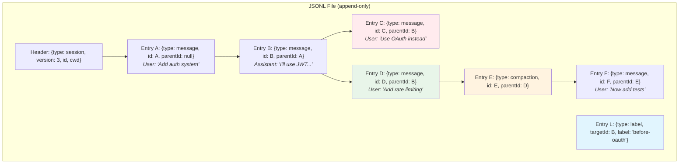

**Tree operations:**

| Operation | Method | Effect |
|-----------|--------|--------|
| Branch | `branch(entryId)` | Move leaf pointer to create new branch |
| Navigate | `navigateTree(targetId)` | Switch to different branch |
| Label | `appendLabelChange(targetId, label)` | Name a checkpoint |
| Compact | `appendCompaction(...)` | Summarize older messages |
| Fork | `fork()` | Create new session file from current branch |

**Context building:** `buildSessionContext()` walks from the current leaf pointer back to root, collecting messages along the branch path, applying compaction summaries, and resolving model/thinking changes.

---

### 5.6 OutputSink and Streaming Output

For tools that produce potentially unbounded output (bash, Python, SSH), the OutputSink handles memory-safe streaming.

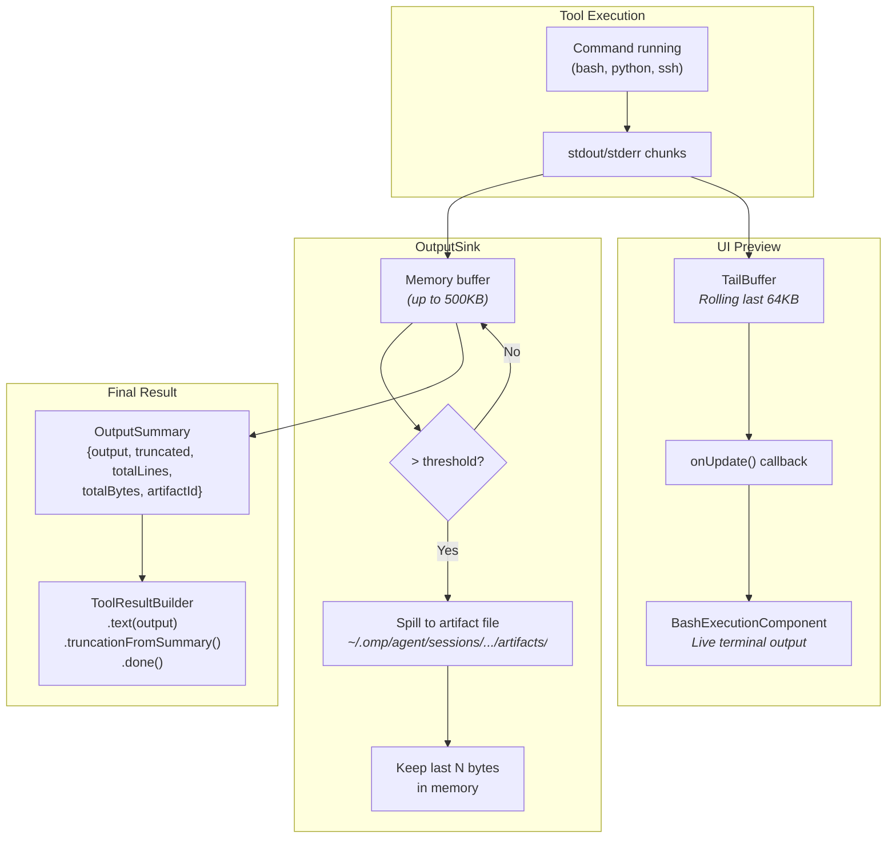

**Pattern used by streaming tools** (from `tools/bash.ts`, `tools/python.ts`, `tools/ssh.ts`):

```typescript
// 1. Allocate artifact path
const { artifactPath, artifactId } = await allocateOutputArtifact(session, "bash");

// 2. Create tail buffer for UI preview
const tailBuffer = createTailBuffer(DEFAULT_MAX_BYTES);

// 3. Execute with streaming callback
const result = await executeBash({
  artifactPath, artifactId,
  onChunk: (chunk) => {
    tailBuffer.append(chunk);
    onUpdate?.({
      content: [{ type: "text", text: tailBuffer.text() }],
      details: {},
    });
  },
});

// 4. Build result with truncation metadata
return toolResult<BashToolDetails>({})
  .text(result.output)
  .truncationFromSummary(result, { direction: "tail" })
  .done();
```

**Key files:**
- `packages/coding-agent/src/session/streaming-output.ts` — `OutputSink`
- `packages/coding-agent/src/tools/output-utils.ts` — `TailBuffer`, `allocateOutputArtifact()`
- `packages/coding-agent/src/tools/tool-result.ts` — `ToolResultBuilder`

---

## 6. Cross-Cutting Concerns

### Event System Architecture

The entire application is event-driven. Events flow through three layers:

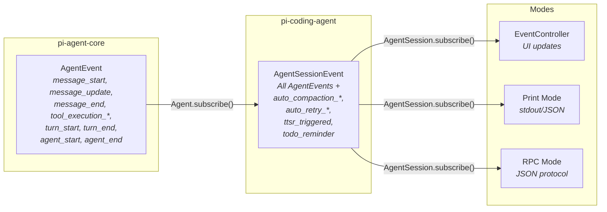

### TTSR (Time-Traveling Streamed Rules)

Rules that inject themselves only when triggered by pattern matches in the LLM's output stream:

```mermaid
sequenceDiagram
    participant LLM as LLM Provider
    participant Loop as Agent Loop
    participant TTSR as TtsrManager
    participant Session as AgentSession

    LLM->>Loop: text_delta "import lodash..."
    Loop->>Session: emit(message_update)
    Session->>TTSR: check(text_delta)
    TTSR->>TTSR: Pattern match:<br/>"lodash" matches<br/>"don't use lodash" rule

    TTSR-->>Session: ttsr_triggered
    Session->>Session: Abort current stream
    Session->>Session: Inject rule as<br/>system reminder
    Session->>Loop: Retry from same point

    Note over LLM: LLM now sees the rule<br/>and avoids lodash
```

**Zero upfront cost:** TTSR rules consume no context tokens until triggered. Each rule fires at most once per session.

### Error Handling and Recovery

```mermaid
flowchart TB
    Error["Error during agent execution"]
    Retryable{Retryable?}
    AutoRetry["Auto-retry<br/><i>Up to 3 attempts<br/>with exponential backoff</i>"]
    ContextOverflow{Context overflow?}
    AutoCompact["Auto-compaction<br/><i>Summarize + retry</i>"]
    Report["Report error to user"]

    Error --> Retryable
    Retryable -->|"Rate limit,<br/>network error"| AutoRetry
    Retryable -->|No| ContextOverflow
    AutoRetry -->|"Still failing"| Report
    ContextOverflow -->|Yes| AutoCompact
    ContextOverflow -->|No| Report
    AutoCompact -->|"Success"| Error
    AutoCompact -->|"Still failing"| Report
```

### Configuration Priority

Settings are resolved with this precedence (highest to lowest):

```
CLI flags (--model, --thinking, etc.)
    ↓
Environment variables (PI_SMOL_MODEL, etc.)
    ↓
Project settings (.omp/settings.json)
    ↓
User settings (~/.omp/agent/settings.json)
    ↓
Built-in defaults
```

For config discovery (AGENTS.md, hooks, tools, etc.):

```
.omp/ > .pi/ > .claude/ > .codex/ > .gemini/
```

---

## Appendix: File Reference Index

| Component | Primary File | Lines |
|-----------|-------------|-------|
| CLI entry | `packages/coding-agent/src/cli.ts` | ~50 |
| Main orchestrator | `packages/coding-agent/src/main.ts` | ~500 |
| SDK factory | `packages/coding-agent/src/sdk.ts` | ~600 |
| AgentSession | `packages/coding-agent/src/session/agent-session.ts` | ~1,200 |
| System prompt builder | `packages/coding-agent/src/system-prompt.ts` | ~300 |
| Interactive mode | `packages/coding-agent/src/modes/interactive-mode.ts` | ~1,500 |
| Print mode | `packages/coding-agent/src/modes/print-mode.ts` | ~150 |
| RPC mode | `packages/coding-agent/src/modes/rpc/rpc-mode.ts` | ~800 |
| Agent class | `packages/agent/src/agent.ts` | ~400 |
| Agent loop | `packages/agent/src/agent-loop.ts` | ~500 |
| LLM stream dispatcher | `packages/ai/src/stream.ts` | ~300 |
| Anthropic provider | `packages/ai/src/providers/anthropic.ts` | ~500 |
| OpenAI provider | `packages/ai/src/providers/openai-completions.ts` | ~400 |
| Google provider | `packages/ai/src/providers/google.ts` | ~400 |
| Tool registry | `packages/coding-agent/src/tools/index.ts` | ~200 |
| Bash tool | `packages/coding-agent/src/tools/bash.ts` | ~400 |
| Read tool | `packages/coding-agent/src/tools/read.ts` | ~500 |
| Hook runner | `packages/coding-agent/src/extensibility/hooks/runner.ts` | ~300 |
| Extension runner | `packages/coding-agent/src/extensibility/extensions/runner.ts` | ~400 |
| Capability registry | `packages/coding-agent/src/capability/index.ts` | ~300 |
| Discovery orchestrator | `packages/coding-agent/src/discovery/index.ts` | ~100 |
| Session manager | `packages/coding-agent/src/session/session-manager.ts` | ~800 |
| OutputSink | `packages/coding-agent/src/session/streaming-output.ts` | ~200 |
| MCP manager | `packages/coding-agent/src/mcp/manager.ts` | ~500 |
| Task executor | `packages/coding-agent/src/task/executor.ts` | ~500 |
| TUI renderer | `packages/tui/src/tui.ts` | ~400 |
| Rust N-API addon | `crates/pi-natives/src/lib.rs` + modules | ~7,500 |
